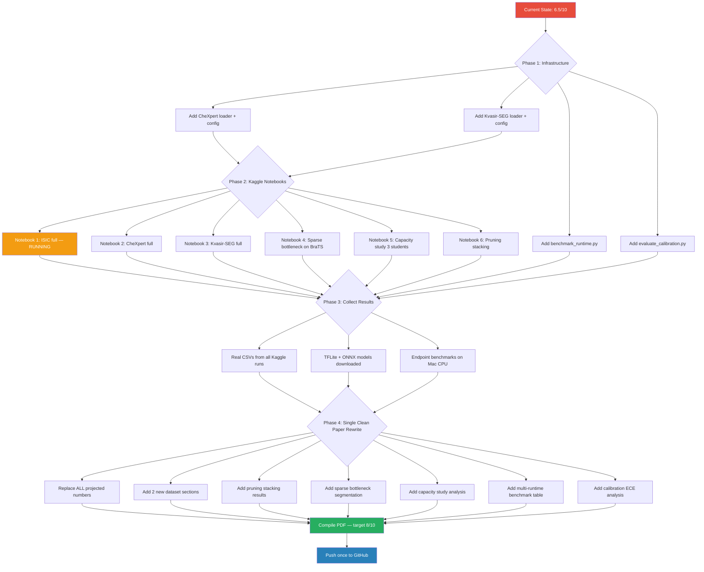

# MedCompress: Execution Plan

## Research Upgrade Pipeline

## Phase Breakdown

### Phase 1: Infrastructure (this session)
Build all missing code. Do NOT touch the paper.

| Task | File | Status |
|------|------|--------|
| CheXpert data loader | `data/chexpert_loader.py` | TODO |
| Kvasir-SEG data loader | `data/kvasir_loader.py` | TODO |
| CheXpert config | `configs/chexpert_baseline.yaml` | TODO |
| Kvasir-SEG config | `configs/kvasir_baseline.yaml` | TODO |
| Calibration metrics (ECE) | `scripts/evaluate_calibration.py` | TODO |
| Kaggle notebook: CheXpert | `notebooks/kaggle_chexpert.py` | TODO |
| Kaggle notebook: Kvasir-SEG | `notebooks/kaggle_kvasir.py` | TODO |
| Kaggle notebook: Capacity study | `notebooks/kaggle_capacity_study.py` | TODO |

### Phase 2: Run on Kaggle (user runs these)
- Notebook 1 (ISIC): RUNNING
- Notebook 2 (CheXpert): after infrastructure
- Notebook 3 (Kvasir-SEG): after infrastructure
- Notebook 4 (Capacity study): after ISIC finishes

### Phase 3: Collect and Verify
- Download all CSVs from Kaggle outputs
- Download .tflite models
- Run endpoint benchmarks on Mac CPU
- Run calibration analysis

### Phase 4: Paper Rewrite
- ONE rewrite with ALL real data
- Do not push intermediate edits
