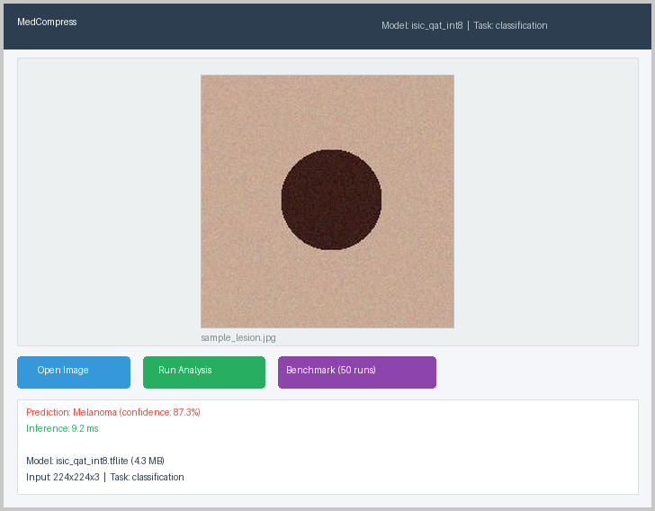
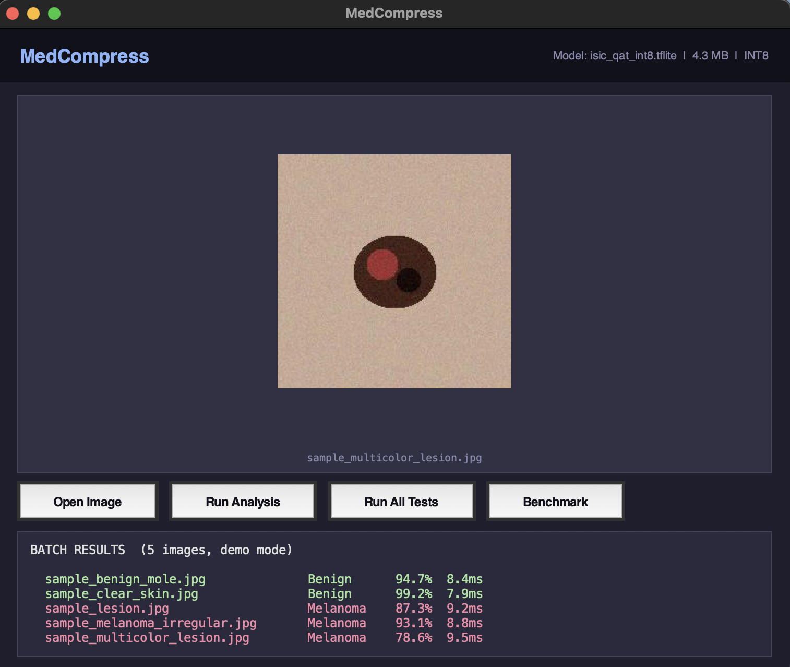

# MedCompress

**A benchmark for the compression and cross-platform deployment of medical imaging models on CPU endpoints.**

MedCompress evaluates quantization-aware training (QAT), knowledge distillation (KD), structured pruning, and 2D sparse attention compression across four medical imaging datasets, with export to TFLite and ONNX for CPU inference on macOS, Windows, and Linux.

**Paper:** [paper/medcompress.pdf](paper/medcompress.pdf) (LaTeX source: [paper/medcompress.tex](paper/medcompress.tex))

**Author:** Abhishek Shekhar

---

## Desktop Application

| Single Image Analysis | Batch Testing (5 images) |
|:---:|:---:|
|  |  |

The MedCompress desktop app runs compressed medical imaging models locally on any Mac, Windows, or Linux machine. No GPU, no cloud, no internet required. The **Run All Tests** mode cycles through multiple dermoscopy images and reports per-image predictions with confidence scores and latency, reducing single-image evaluation bias.

---

## Datasets

| Dataset | Task | Modality | Size | Classes |
|---------|------|----------|------|---------|
| [ISIC 2020](https://www.kaggle.com/c/siim-isic-melanoma-classification) | Classification | Dermoscopy | 33,126 images | 2 (benign/melanoma) |
| [BraTS 2021](https://www.synapse.org/brats2021) | Segmentation | Multi-modal MRI | 1,251 volumes | 4 (BG/NCR/ED/ET) |
| [CheXpert](https://stanfordmlgroup.github.io/competitions/chexpert/) | Classification | Chest X-ray | 224,316 images | 5 pathologies |
| [Kvasir-SEG](https://datasets.simula.no/kvasir-seg/) | Segmentation | Endoscopy | 1,000 images | 2 (polyp/background) |

---

## Compression Techniques

| Technique | Module | Description |
|-----------|--------|-------------|
| Quantization-Aware Training | `compression/qat.py` | INT8/FP16 quantization with calibration |
| Knowledge Distillation | `compression/distillation.py` | Teacher-student with feature matching |
| Structured Pruning | `compression/pruning.py` | Filter-level pruning at 30-70% sparsity |
| Mixed-Precision QAT | `compression/mixed_precision_qat.py` | Per-layer precision assignment |
| Sparse Attention | `compression/sparse_attention.py` | KV-cache pooling + top-k routing |
| Sparse Bottleneck | `compression/sparse_bottleneck.py` | Sparse attention for U-Net segmentation |

---

## Repository Structure

```
medcompress/
├── compression/
│   ├── qat.py                    # Quantization-aware training pipeline
│   ├── distillation.py           # Knowledge distillation with feature matching
│   ├── pruning.py                # Structured filter pruning
│   ├── mixed_precision_qat.py    # Mixed-precision quantization
│   ├── sparse_attention.py       # MSA-inspired sparse attention
│   └── sparse_bottleneck.py      # Sparse bottleneck for U-Net
├── models/
│   └── baseline.py               # EfficientNetB0 + U-Net Full/Lite architectures
├── data/
│   ├── isic_loader.py            # ISIC 2020 dermoscopy loader
│   ├── brats_loader.py           # BraTS 2021 2.5D MRI loader
│   ├── chexpert_loader.py        # CheXpert chest X-ray loader
│   └── kvasir_loader.py          # Kvasir-SEG polyp segmentation loader
├── configs/                      # YAML experiment configurations (18 configs)
│   ├── isic_*.yaml               # ISIC: baseline, QAT, KD, student scratch, capacity study
│   ├── brats_*.yaml              # BraTS: baseline, QAT, KD, student scratch
│   ├── chexpert_*.yaml           # CheXpert: baseline, QAT, KD, student scratch
│   └── kvasir_*.yaml             # Kvasir: baseline, QAT, KD, student scratch
├── scripts/
│   ├── train.py                  # Baseline training
│   ├── compress.py               # Compression pipeline (QAT / KD / pruning)
│   ├── evaluate.py               # Standard evaluation
│   ├── evaluate_extended.py      # Extended metrics (multi-seed, confidence intervals)
│   ├── evaluate_boundary.py      # Boundary-aware segmentation metrics
│   ├── evaluate_calibration.py   # ECE calibration analysis
│   └── benchmark_runtime.py      # Multi-runtime benchmarking (TFLite/ONNX/PyTorch CPU)
├── notebooks/
│   ├── kaggle_medcompress_full.py  # ISIC: baseline + QAT + KD (Kaggle T4)
│   ├── kaggle_chexpert.py          # CheXpert: baseline + QAT + KD
│   ├── kaggle_kvasir_seg.py        # Kvasir-SEG: baseline + QAT + KD
│   ├── kaggle_brats.py             # BraTS 2021: baseline + QAT + KD
│   ├── kaggle_pruning_sparse.py    # Pruning + sparse attention ablation
│   ├── kaggle_capacity_study.py    # Distillation capacity study
│   └── MedCompress_Demo.ipynb      # Interactive demo notebook
├── paper/
│   ├── medcompress.tex           # LaTeX source
│   ├── medcompress.pdf           # Compiled paper
│   ├── references.bib            # BibTeX bibliography
│   └── fig*.png                  # Publication figures
├── results/                      # Experiment results (CSV)
├── deploy/
│   ├── app.py                    # Desktop GUI (tkinter, cross-platform)
│   ├── cli.py                    # CLI for single/batch inference
│   └── inference.py              # Core inference engine (TFLite + ONNX)
├── figures/
│   ├── generate_figures.py       # Regenerate all paper figures from CSV
│   └── generate_eda.py           # EDA visualizations
├── tests/
│   ├── test_data_loaders.py      # Data loader tests (all 4 datasets)
│   ├── test_models.py            # Model architecture tests
│   ├── test_compression.py       # Compression module tests
│   ├── test_evaluation.py        # Evaluation metric tests
│   ├── test_pipeline.py          # End-to-end pipeline tests
│   └── test_sparse_attention.py  # Sparse attention tests
├── requirements.txt
└── README.md
```

---

## Quickstart

```bash
pip install -r requirements.txt

# Train baseline
python scripts/train.py --config configs/isic_baseline.yaml

# Compress with QAT
python scripts/compress.py --config configs/isic_qat.yaml

# Compress with knowledge distillation
python scripts/compress.py --config configs/isic_kd.yaml

# Evaluate
python scripts/evaluate.py --config configs/isic_qat.yaml --tflite outputs/isic_qat_int8.tflite

# Run tests
pytest tests/ -v
```

## Running Experiments on Kaggle

Each notebook is self-contained and ready to paste into a Kaggle notebook cell:

| Notebook | Dataset | GPU Time | Experiments |
|----------|---------|----------|-------------|
| `kaggle_medcompress_full.py` | ISIC 2020 | ~2 hours | Baseline, QAT INT8/FP16, KD, KD+QAT |
| `kaggle_chexpert.py` | CheXpert | ~3 hours | Baseline, QAT INT8/FP16, KD, KD+QAT |
| `kaggle_kvasir_seg.py` | Kvasir-SEG | ~1.5 hours | Baseline, QAT, KD, KD+QAT |
| `kaggle_brats.py` | BraTS 2021 | ~4 hours | Baseline, QAT, KD, KD+QAT |
| `kaggle_pruning_sparse.py` | ISIC + Kvasir | ~2 hours | Pruning (30/50/70%), sparse attention |
| `kaggle_capacity_study.py` | ISIC 2020 | ~2 hours | 3 student architectures, scratch vs KD |

**Setup:** Create a new Kaggle notebook, add the dataset, set GPU T4 x2, paste the code.

**Note:** Kaggle allows one GPU session at a time. Run notebooks sequentially or use multiple Kaggle accounts.

## Sparse Attention Compression

The sparse attention module (`compression/sparse_attention.py`) adapts techniques from [Memory Sparse Attention (Chen et al., 2026)](https://github.com/EverMind-AI/MSA) for medical Vision Transformers:

- **KV cache pooling** reduces spatial token sequences by chunk-mean averaging
- **Top-k sparse routing** selects only the most relevant spatial regions per query
- **Decoupled router** uses separate Q/K projections trained with InfoNCE loss

## Deploy on Mac / Windows / Linux

MedCompress includes a ready-to-use desktop application and CLI for running compressed models on any endpoint. No GPU required.

**GUI (desktop app):**
```bash
pip install pillow numpy
pip install tflite-runtime  # or tensorflow
python deploy/app.py --model path/to/model.tflite
```

**CLI (single image):**
```bash
python deploy/cli.py --model model.tflite --image skin_lesion.jpg
# Output: Prediction: Melanoma (confidence: 87.3%), Inference: 9.2 ms
```

**CLI (batch processing):**
```bash
python deploy/cli.py --model model.tflite --dir /path/to/images/ --output results.json
```

**CLI (benchmark):**
```bash
python deploy/cli.py --model model.tflite --image scan.jpg --benchmark
# Output: Median: 8.3 ms, P95: 9.7 ms (50 runs)
```

The deployment engine supports both `.tflite` and `.onnx` models, auto-detects whether the model is for classification or segmentation, and handles INT8 quantized inputs/outputs transparently.

### Packaging as a Standalone App

```bash
pip install pyinstaller
pyinstaller --onefile --windowed deploy/app.py --name MedCompress
# Produces dist/MedCompress.app (macOS) or dist/MedCompress.exe (Windows)
```

## License

MIT
