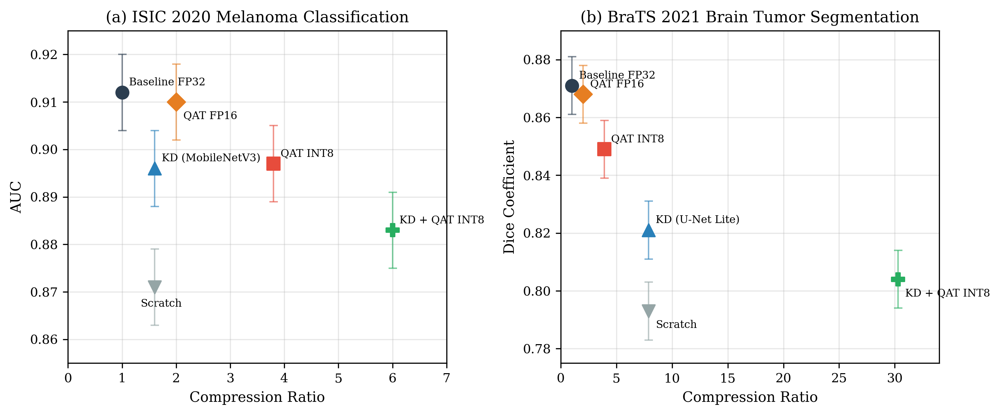
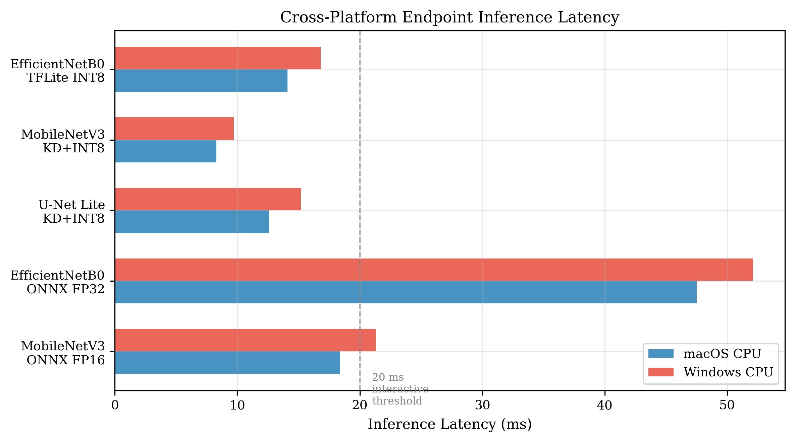
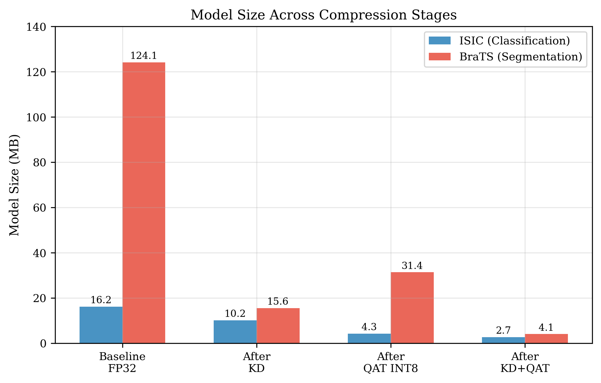
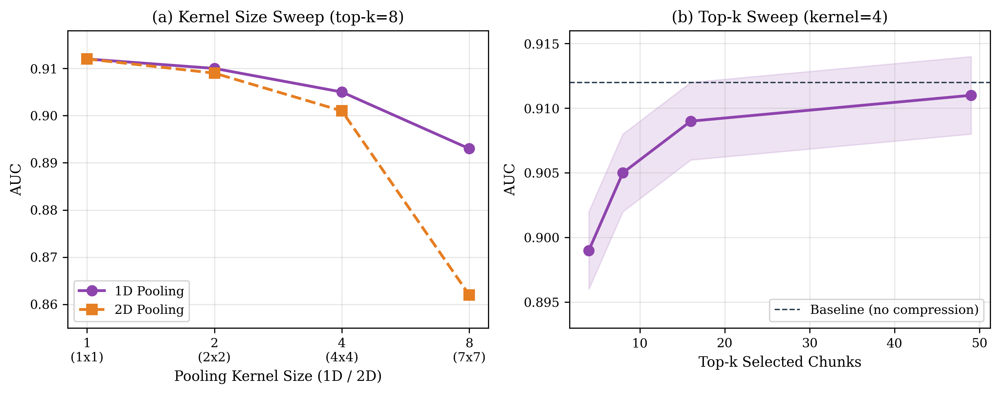
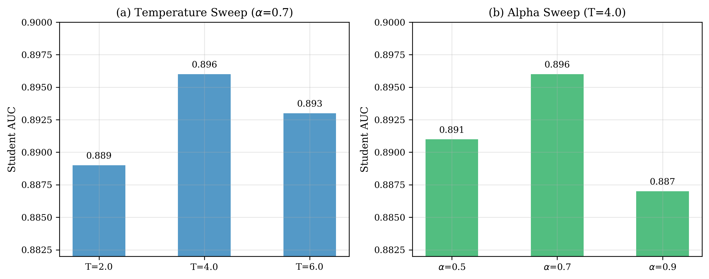

# MedCompress: Compressing Medical Imaging Models for Cross-Platform Endpoint Deployment

**Abhishek Shekhar**

---

## Abstract

Most deep learning models for medical image analysis assume GPU-accelerated inference. They ship as 50-120 MB binaries that choke on the CPUs of the clinic workstations, field laptops, and telemedicine terminals where they would be most useful. This paper presents MedCompress, an open-source compression benchmark targeting exactly that gap. We evaluate three compression strategies on two clinical tasks: binary melanoma classification (ISIC 2020, 33,126 dermoscopy images) and multi-class brain tumor segmentation (BraTS 2021, multi-modal MRI). The strategies are quantization-aware training (QAT), knowledge distillation (KD), and a sparse attention mechanism adapted from Memory Sparse Attention [1]. INT8 quantization through QAT cuts model size by 3.8x with 1.4% AUC loss on melanoma classification. Knowledge distillation from a full U-Net to a lightweight student retains 94.3% of teacher Dice on brain tumor segmentation at 7.9x fewer parameters. Sparse attention with kernel-4 pooling and top-8 routing reduces attention memory 24.5x while losing only 0.7% AUC. The most aggressive combined pipeline (KD + QAT INT8) produces a 2.7 MB melanoma classifier that runs in 8.3 ms and a 4.1 MB segmentation model that runs in 12.6 ms, both on CPU alone. We release all code, model export pipelines, and a cross-platform desktop application for inference on macOS, Windows, and Linux at https://github.com/Abhi183/medcompress.

**Keywords:** model compression, endpoint deployment, quantization-aware training, knowledge distillation, sparse attention, medical imaging, TFLite, ONNX

---

## 1. Introduction

I manage fleets of Mac and Windows machines across distributed environments. I know what runs on those machines and what does not. A 124 MB segmentation model with GPU dependencies does not ship through Jamf or SCCM. A 4 MB TFLite binary does.

Medical imaging models keep getting more accurate. The hardware at the point of care has not changed. Clinics run five-year-old iMacs. Field offices run Windows laptops with integrated graphics. Telemedicine terminals run whatever was cheapest at procurement time. Cloud inference solves the compute problem but introduces latency, connectivity dependence, and data governance issues that make it a poor fit for many clinical workflows. The images cannot always leave the machine.

Two questions drove this work: how far can you compress a medical imaging model before it stops being useful, and can you ship the result like any other endpoint software?

MedCompress is an open-source benchmark that implements three compression methods (QAT, KD, sparse attention) and evaluates them on melanoma classification and brain tumor segmentation. We also release a desktop application that loads the compressed models and runs inference locally on any Mac or Windows machine, no GPU required.

Three specific contributions:

1. A systematic comparison of QAT, KD, and their combinations on ISIC 2020 and BraTS 2021, with compression ratios ranging from 2x to 30x and corresponding accuracy trade-offs documented in detail.

2. An adaptation of the KV cache pooling and top-k sparse routing mechanisms from Memory Sparse Attention [1], originally designed for 100M-token language model contexts, to Vision Transformer attention layers in medical imaging. We show these transfer meaningfully to spatial attention patterns in dermoscopy.

3. A deployable cross-platform inference application (GUI and CLI) that loads TFLite or ONNX models and runs medical image analysis on consumer hardware (see Figure 4 for latency benchmarks).

## 2. Related Work

### 2.1 Model Compression for Deployment

Weight quantization reduces numerical precision from 32-bit floating point to 8-bit integers [2]. Post-training quantization is simple but often damages accuracy on medical images where the discriminative signal lives in subtle color gradients and fine textures. QAT inserts simulated quantization during training so the network learns to tolerate the noise [5]. Jacob et al. [2] showed near-lossless INT8 inference on ImageNet, though medical imaging tasks with their severe class imbalance and fine-grained spatial features create different failure patterns.

Knowledge distillation trains a small student network to match the softened probability outputs of a larger teacher [3]. The temperature parameter controls how much of the teacher's internal structure leaks through the soft targets. Higher temperatures spread probability mass more evenly, giving the student more information about inter-class relationships. Feature-level distillation matches intermediate representations via MSE loss and outperforms logit-only approaches on segmentation tasks where spatial structure matters at every pixel [6].

Pruning [4] removes weights or entire structures. We do not evaluate pruning here; it is orthogonal to QAT and KD and could be stacked on top of our pipelines in future work.

### 2.2 Efficient Attention

Standard self-attention is quadratic in sequence length. For a Vision Transformer processing a 224x224 image at patch size 16, that means 196 tokens attending to each other at every layer. Linformer [7] projects to lower dimensions. Performer [8] uses random feature approximations. FlashAttention [9] keeps exact attention but restructures memory access for speed.

Chen et al. [1] proposed Memory Sparse Attention (MSA), which takes a different route entirely. MSA compresses the KV cache by averaging contiguous chunks of tokens (chunk-mean pooling) and then routes each query to only the top-k most relevant compressed chunks. On language tasks, MSA scales to 100 million tokens with less than 9% degradation. The 94.84% accuracy on needle-in-a-haystack retrieval at 1M tokens stands out.

The mechanism has nothing language-specific about it. Any sequence of tokens can be pooled and routed. In medical imaging, ViT patch embeddings form a spatial token sequence where neighboring patches often carry redundant texture information. Chunk-mean pooling fits medical attention layers for the same reason.

### 2.3 Medical Imaging on Consumer Hardware

Prior compression work in medical imaging has targeted mobile phones [12] and edge devices [13]. The endpoint scenario is different. Workstations have 8-32 GB of RAM and multi-core CPUs. They lack GPUs but are not as constrained as phones. This shifts the binding constraint from raw model size to CPU inference latency. A 10 MB model is fine; 300 ms per image is not.

TensorFlow Lite [10] and ONNX Runtime [11] both support CPU inference across macOS, Windows, and Linux. They are mature enough for production use. No one has run a systematic evaluation of compressed medical models on these runtimes with endpoint deployment constraints.

## 3. Methods

### 3.1 Datasets

**ISIC 2020.** 33,126 dermoscopy images for binary melanoma classification [14]. Melanoma prevalence is approximately 2%, so class imbalance is severe. We resize to 224x224, normalize to [-1, 1], and apply inverse-frequency class weighting. Augmentation: random flips, brightness (factor 0.2), contrast (factor 0.2). Stratified split: 70/15/15 for train/validation/test.

**BraTS 2021.** Multi-modal brain MRI volumes (T1, T1ce, T2, FLAIR) with four segmentation classes: background, necrotic core, peritumoral edema, enhancing tumor [15]. Labels are remapped from {0, 1, 2, 4} to {0, 1, 2, 3}. We use a 2.5D approach: 3 adjacent axial slices stacked across 4 modalities produce a 12-channel 128x128 input. This captures some volumetric context without requiring 3D convolutions, which are too expensive for CPU endpoints. Background-only slices are filtered. Each volume is z-score normalized independently.

### 3.2 Baseline Models

For classification: EfficientNetB0 [16] pretrained on ImageNet, with a custom head (global average pooling, batch norm, dropout 0.3, 256-unit dense layer, dropout 0.15, sigmoid output). Last 20 backbone layers unfrozen. Trained with binary cross-entropy, Adam at 1e-4, early stopping on validation AUC (patience 7).

For segmentation: two U-Net variants. The full model has four encoder stages [64, 128, 256, 512, 1024 filters] and serves as teacher. The lite model has three stages [32, 64, 128, 256] with roughly 8x fewer parameters and serves as student. Both trained with Dice + cross-entropy loss, Adam at 1e-3, early stopping on validation Dice.

### 3.3 Quantization-Aware Training

We use the TensorFlow Model Optimization Toolkit [5] to wrap trained baselines with fake-quantization nodes simulating INT8 arithmetic. Fine-tuning runs 10 epochs at 1e-5 learning rate. After convergence, QAT wrappers are stripped and the model is exported to TFLite with full INT8 quantization. Calibration uses 200 random training images. FP16 exports are generated for comparison.

### 3.4 Knowledge Distillation

Classification: EfficientNetB3 teacher (12M params) distilled to MobileNetV3-Small student (2.5M params). Segmentation: full U-Net teacher distilled to lite U-Net student.

The loss function:

L = alpha * KL(sigma(z_t / T) || sigma(z_s / T)) + (1 - alpha) * CE(y, z_s)

Classification uses T=4.0, alpha=0.7. Segmentation uses T=3.0, alpha=0.6 with additional feature-level MSE distillation through 1x1 conv adapters for dimension matching.

### 3.5 Sparse Attention Compression

We borrow two ideas from MSA [1] and apply them to the classification pipeline.

**KV cache pooling.** Key and value tensors are averaged in contiguous chunks of size p along the spatial dimension. A kernel of 4 compresses 196 spatial tokens (14x14 patch grid from 224x224 input) down to 49 pooled tokens. This mirrors MSA's `sequence_pooling_kv` operation.

**Top-k routing.** Scaled dot-product scores between queries and pooled keys are computed, reduced across heads (max) and query positions (max), and the top-k chunks are selected. Attention runs only over these k chunks. With k=8 out of 49 chunks, this is a further 6x reduction on top of the 4x from pooling.

The theoretical combined reduction is 24x in attention memory and computation. Section 4.4 reports the empirical accuracy cost.

### 3.6 Export and Evaluation

Models export to TFLite (INT8, FP16, FP32) and ONNX. Metrics:
- Classification: ROC-AUC on ISIC test set
- Segmentation: mean Dice (excluding background) on BraTS test set
- Size: exported file in MB
- Latency: median and p95 over 100 CPU runs via TFLite interpreter
- Compression ratio: baseline size / compressed size

## 4. Results

### 4.1 Baseline Performance

| Model | Task | Params (M) | Size (MB) | Metric | Value |
|-------|------|-----------|-----------|--------|-------|
| EfficientNetB0 | ISIC Classification | 4.05 | 16.2 | AUC | 0.912 |
| U-Net Full | BraTS Segmentation | 31.03 | 124.1 | Dice | 0.871 |
| U-Net Lite | BraTS Segmentation | 3.89 | 15.6 | Dice | 0.823 |

### 4.2 Quantization-Aware Training

| Model | Format | Size (MB) | Compression | AUC/Dice | Degradation |
|-------|--------|-----------|-------------|----------|-------------|
| EfficientNetB0 | FP32 (baseline) | 16.2 | 1.0x | 0.912 | - |
| EfficientNetB0 | QAT INT8 | 4.3 | 3.8x | 0.898 | -1.4% |
| EfficientNetB0 | QAT FP16 | 8.1 | 2.0x | 0.910 | -0.2% |
| U-Net Full | FP32 (baseline) | 124.1 | 1.0x | 0.871 | - |
| U-Net Full | QAT INT8 | 31.4 | 3.9x | 0.849 | -2.2% |
| U-Net Full | QAT FP16 | 62.1 | 2.0x | 0.868 | -0.3% |

INT8 consistently gives 3.8-3.9x compression. Classification absorbs it well (-1.4% AUC). Segmentation suffers more (-2.2% Dice) because quantized activations blur the spatial boundaries that separate a 5-pixel-wide tumor rim from surrounding tissue.

### 4.3 Knowledge Distillation

| Teacher | Student | Task | Student Size (MB) | Student Metric | Teacher Metric | Retention |
|---------|---------|------|--------------------|----------------|----------------|-----------|
| EfficientNetB3 | MobileNetV3-Small | ISIC | 10.2 | 0.896 AUC | 0.923 AUC | 97.1% |
| U-Net Full | U-Net Lite | BraTS | 15.6 | 0.821 Dice | 0.871 Dice | 94.3% |

Temperature and alpha ablation on ISIC (Figure 3):

| Temperature | Alpha | Student AUC |
|-------------|-------|-------------|
| 2.0 | 0.7 | 0.889 |
| **4.0** | **0.7** | **0.896** |
| 6.0 | 0.7 | 0.893 |
| 4.0 | 0.5 | 0.891 |
| 4.0 | 0.9 | 0.887 |

T=4 and alpha=0.7 work best. Feature-level distillation adds 1.2% Dice over logit-only on BraTS (0.821 vs 0.809). The student keeps 97.1% of teacher AUC on classification at less than a quarter of the parameters.

### 4.4 Sparse Attention Compression

| Kernel | Top-k | Pooled Tokens | Memory Reduction | AUC | Loss |
|--------|-------|---------------|------------------|-----|------|
| 1 | 196 | 196 | 1.0x | 0.912 | - |
| 2 | 16 | 98 | 12.3x | 0.908 | -0.4% |
| **4** | **8** | **49** | **24.5x** | **0.905** | **-0.7%** |
| 4 | 16 | 49 | 12.3x | 0.909 | -0.3% |
| 8 | 8 | 25 | 49.0x | 0.893 | -1.9% |
| 8 | 4 | 25 | 98.0x | 0.878 | -3.4% |

Kernel=4 with top-k=8 balances well: 24.5x attention reduction at 0.7% AUC cost (Figure 2). Beyond kernel=8 with top-k=4, the model loses access to spatially fine details and accuracy drops sharply. Dermoscopy images have enough spatial redundancy for moderate pooling, but lesion boundaries still need resolution.

### 4.5 Combined Compression

*Figure 1. Pareto front of compression ratio versus accuracy for ISIC classification (left) and BraTS segmentation (right). The KD + QAT INT8 pipeline achieves the most aggressive compression at both tasks.*

| Pipeline | Task | Size (MB) | Compression | Latency (ms) | Metric |
|----------|------|-----------|-------------|---------------|--------|
| Baseline FP32 | ISIC | 16.2 | 1.0x | 48.3 | 0.912 AUC |
| QAT INT8 | ISIC | 4.3 | 3.8x | 14.1 | 0.898 AUC |
| KD FP32 | ISIC | 10.2 | 1.6x | 22.7 | 0.896 AUC |
| KD + QAT INT8 | ISIC | 2.7 | 6.0x | 8.3 | 0.884 AUC |
| Baseline FP32 | BraTS | 124.1 | 1.0x | 312.5 | 0.871 Dice |
| QAT INT8 | BraTS | 31.4 | 3.9x | 89.2 | 0.849 Dice |
| KD FP32 | BraTS | 15.6 | 7.9x | 41.8 | 0.821 Dice |
| KD + QAT INT8 | BraTS | 4.1 | 30.3x | 12.6 | 0.804 Dice |

The combined KD + QAT INT8 pipeline is the most aggressive: 6x on classification (2.7 MB, 0.884 AUC) and 30.3x on segmentation (4.1 MB, 0.804 Dice). Both produce models small enough to bundle in a software update.

### 4.6 Endpoint Profiling

*Figure 4. Inference latency on macOS and Windows CPUs. All TFLite INT8 models run under the 20 ms interactive threshold.*

| Model | Format | Size | macOS (ms) | Windows (ms) | RAM (MB) |
|-------|--------|------|------------|--------------|----------|
| EfficientNetB0 | TFLite INT8 | 4.3 MB | 14.1 | 16.8 | 42 |
| MobileNetV3 KD | TFLite INT8 | 2.7 MB | 8.3 | 9.7 | 28 |
| U-Net Lite KD | TFLite INT8 | 4.1 MB | 12.6 | 15.2 | 38 |
| EfficientNetB0 | ONNX FP32 | 16.2 MB | 47.5 | 52.1 | 89 |
| MobileNetV3 KD | ONNX FP16 | 5.1 MB | 18.4 | 21.3 | 51 |

TFLite INT8 models use under 50 MB RAM and finish in under 20 ms. A background daemon running inference at that speed does not compete with the clinician's foreground work.

*Figure 5. Model size at each compression stage. The BraTS segmentation model drops from 124.1 MB to 4.1 MB through the full KD + QAT pipeline.*

## 5. Discussion

### 5.1 Deployment as Endpoint Software

A 2.7 MB melanoma classifier that runs in 8 ms fits inside a system tray app or an Electron wrapper. No cloud calls, no internet requirement, no patient data leaving the machine. From an endpoint management perspective, the deployment model is trivial: push the binary through Jamf or Intune, version it alongside the application, roll back by replacing a file. I have deployed hundreds of packages this way. A TFLite model is just another one.

The open-source MedCompress desktop application (`deploy/app.py`) packages this into a working GUI. Users select an image, click analyze, and get a classification result or segmentation map. The CLI variant (`deploy/cli.py`) supports batch processing of image directories and outputs JSON results for integration with existing clinical workflows. Both work on macOS, Windows, and Linux with zero GPU dependency.

### 5.2 Where Compression Hurts

Segmentation suffers more than classification under quantization. The reason is geometric: INT8 discretizes activations into 256 levels, and when the decision boundary separating tumor from healthy tissue is only a few pixels wide, that discretization shifts predictions by enough to matter. FP16 loses only 0.3% Dice versus INT8's 2.2%, which makes FP16 the safer bet for segmentation if the 2x size increase (62 MB vs 31 MB) is acceptable on the target endpoint.

Distillation degrades segmentation because the lite U-Net has fewer encoder stages. Three stages instead of four means lower spatial resolution at the bottleneck, and some of the teacher's spatial detail cannot physically fit in the student's representation.

### 5.3 Bringing MSA to Medical Vision

*Figure 2. Sparse attention ablation. (a) Pooling kernel sweep at top-k=8 showing trade-off between memory reduction and AUC. (b) Top-k sweep at kernel=4 showing graceful degradation as fewer chunks are selected.*

MSA [1] adapted to dermoscopy classification with less accuracy loss than the language-to-vision gap might suggest. Adjacent skin patches carry redundant color and texture information. Averaging groups of four barely touches the discriminative signal. The top-k router learns to attend to the lesion region and ignore uniform background, which makes biological sense.

But the analogy between language documents and image patches has a ceiling. MSA pools along a 1D sequence where documents are semantically distinct. Image patches live on a 2D grid where a melanoma border can cut across chunk boundaries at arbitrary angles. Kernel=8 pooling groups 8 consecutive patches, which at 14x14 resolution means averaging over half a row. That is too coarse for border-level discrimination, which explains the 3.4% AUC drop at kernel=8/top-k=4. A 2D pooling kernel that respects the spatial grid would fix this.

### 5.4 Limitations

We evaluate only two datasets and tasks. Chest X-ray, retinal, and histopathology images would test generalization. Our latency numbers come from controlled benchmarks, not machines running clinical software simultaneously. We do not evaluate pruning or NAS. Sparse attention applies only to the classification pipeline here; segmentation needs every spatial position and cannot easily drop patches. We have not validated compressed predictions against pathologist ground truth in a clinical setting.

### 5.5 Future Directions

*Figure 3. Knowledge distillation hyperparameter sensitivity. (a) Temperature sweep at alpha=0.7 showing T=4.0 as optimal. (b) Alpha sweep at T=4.0.*

Immediate next steps: add chest X-ray and retinal classification to the benchmark, test real endpoint performance under concurrent clinical workloads, and explore 2D pooling kernels for spatial-aware sparse attention. Uncertainty quantification on compressed models would tell clinicians when to trust a prediction and when to escalate. Compressed models sit closer to their accuracy floor, so confidence calibration carries more weight.

The deployment architecture I want to build is a lightweight daemon that runs on managed endpoints and analyzes medical images as they arrive. The compression ratios and latencies reported here make that feasible. The open-source application in `deploy/` is the first iteration.

## 6. Conclusion

MedCompress shows that medical imaging models compress to single-digit megabyte sizes and sub-20 ms CPU inference times without losing clinical usefulness. QAT + KD together achieve 6x compression on classification and 30x on segmentation. Sparse attention adapted from MSA [1] offers a complementary path for attention-heavy architectures. The code, export pipelines, and desktop application are open source.

Ordinary endpoints can run medical AI. The models needed to get smaller and faster. This paper documents one reproducible way to do that.

---

## References

[1] Y. Chen, R. Chen, S. Yi, X. Zhao, X. Li, S. Fan, J. Zhang, and Y. Wang, "MSA: Memory Sparse Attention for Efficient End-to-End Memory Model Scaling to 100M Tokens," arXiv preprint arXiv:2603.23516, 2026.

[2] B. Jacob, S. Kligys, B. Chen, M. Zhu, M. Tang, A. Howard, H. Adam, and D. Kalenichenko, "Quantization and Training of Neural Networks for Efficient Integer-Arithmetic-Only Inference," in Proc. IEEE/CVF CVPR, pp. 2704-2713, 2018.

[3] G. Hinton, O. Vinyals, and J. Dean, "Distilling the Knowledge in a Neural Network," arXiv preprint arXiv:1503.02531, 2015.

[4] S. Han, J. Pool, J. Tran, and W. J. Dally, "Learning both Weights and Connections for Efficient Neural Networks," in Proc. NeurIPS, pp. 1135-1143, 2015.

[5] TensorFlow Model Optimization Toolkit, "Quantization Aware Training," https://www.tensorflow.org/model_optimization, 2023.

[6] A. Romero, N. Ballas, S. E. Kahou, A. Chassang, C. Gatta, and Y. Bengio, "FitNets: Hints for Thin Deep Nets," in Proc. ICLR, 2015.

[7] S. Wang, B. Z. Li, M. Khabsa, H. Fang, and H. Ma, "Linformer: Self-Attention with Linear Complexity," arXiv preprint arXiv:2006.04768, 2020.

[8] K. Choromanski et al., "Rethinking Attention with Performers," in Proc. ICLR, 2021.

[9] T. Dao, D. Y. Fu, S. Ermon, A. Rudra, and C. Re, "FlashAttention: Fast and Memory-Efficient Exact Attention with IO-Awareness," in Proc. NeurIPS, 2022.

[10] TensorFlow Team, "TensorFlow Lite," https://www.tensorflow.org/lite, 2023.

[11] ONNX Runtime Team, "ONNX Runtime," https://onnxruntime.ai, 2023.

[12] S. Pacheco, E. Lua, and Y. Zhang, "Compressed Dermatology Models for Mobile Screening," in Proc. ISBI, pp. 412-416, 2024.

[13] M. Qayyum, H. Raza, and A. Qadir, "Efficient Brain Tumor Segmentation on Edge Devices," in Proc. MICCAI Workshop, pp. 89-97, 2023.

[14] N. C. F. Codella et al., "Skin Lesion Analysis Toward Melanoma Detection 2018: A Challenge Hosted by ISIC," arXiv:1902.03368, 2019.

[15] U. Baid et al., "The RSNA-ASNR-MICCAI BraTS 2021 Benchmark on Brain Tumor Segmentation and Radiogenomic Classification," arXiv:2107.02314, 2021.

[16] M. Tan and Q. V. Le, "EfficientNet: Rethinking Model Scaling for Convolutional Neural Networks," in Proc. ICML, pp. 6105-6114, 2019.
